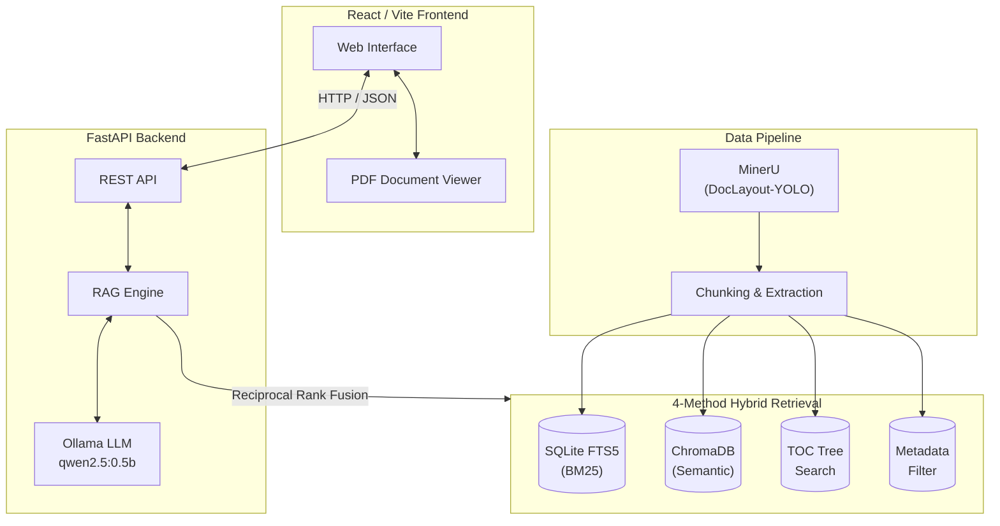

# AI Textbook Q&A System

A RAG-based Educational Question Answering System with Deep Source Tracing, built with a FastAPI backend and a modern React/Vite frontend.

## Overview

This system answers questions about AI, Machine Learning, and NLP concepts using a curated collection of **46 canonical textbooks** as the knowledge base. It features **deep source tracing** — not just citing a book title, but pinpointing the exact page and region where the answer was found, along with a built-in PDF viewer.

## Architecture

The system follows a modern decoupled architecture, combining a hybrid retrieval RAG engine via a REST API with a responsive web interface.



### 4-Method Hybrid Retrieval + RRF Fusion

| # | Method | Description |
|---|--------|-------------|
| 1 | **SQLite FTS5 (BM25)** | Full-text keyword search with BM25 ranking. |
| 2 | **ChromaDB (Semantic)** | Vector search using sentence-transformers embeddings. |
| 3 | **TOC Tree Search** | Hierarchical table-of-contents navigation. |
| 4 | **Metadata Filter** | Structured filtering by book, chapter, page, content type. |

Results from all methods are combined using **Reciprocal Rank Fusion (RRF)**, ensuring the most relevant and robust answers are brought to the top.

## Features

- **Deep Source Tracing & PDF Rendering**: Click any source reference to instantly open the built-in PDF viewer, jumping directly to the exact page and highlighting the source region.
- **Advanced Hybrid Search**: Combines semantic understanding (ChromaDB) with lexical precision (BM25) and structural awareness (TOC/Metadata) for highly accurate retrieval.
- **Smart Result Scoring**: Uses Reciprocal Rank Fusion (RRF) with normalized scoring (0-1) to present intuitive confidence metrics to the user.
- **Layout-Aware Parsing**: Textbooks are processed using MinerU (DocLayout-YOLO) to accurately preserve tables, formulas, and figures during the chunking phase.
- **Interactive UI**: A sleek, fully responsive React interface with smart auto-suggest topics and dynamic related queries.
- **Offline & Local-First**: Runs entirely locally using Ollama (`qwen2.5:0.5b`), ensuring data privacy and requiring low computational resources (~0.4GB footprint).
- **ROS 2 Integration (Part 2)**: Designed with decoupled OOP structures to be easily integrated into a multi-node ROS 2 robotics pipeline.

## Quick Start

### 1. Start Ollama and Pull Model

```bash
ollama serve
ollama pull qwen2.5:0.5b
```

### 2. Start the FastAPI Backend

```bash
cd backend
pip install -r requirements.txt
python -m uvicorn api.main:app --reload --port 8000
```

### 3. Start the React Frontend

```bash
cd frontend
npm install
npm run dev
```

## Project Structure

```text
nlp/
├── backend/
│   ├── api/              # FastAPI endpoints
│   ├── pipeline/         # Data pipeline (chunking, indexing, TOC)
│   ├── retrieval/        # 4 search methods + RRF fusion
│   └── rag/              # Ollama RAG engine (OOP)
├── frontend/
│   ├── src/              # React/Vite source code
│   └── public/           # Static assets
├── ros2/                 # ROS2 node integration scripts
├── guide/                # Project documentation, PPTs, evaluation reports
├── data/                 # Generated SQLite and Chroma databases
└── mineru_output/        # MinerU processed textbooks extraction
```

## Team

- **Wang, Peng**
- **Yoo, Hye Ran**

## Course

CST8507: Natural Language Processing — Assignment 2
