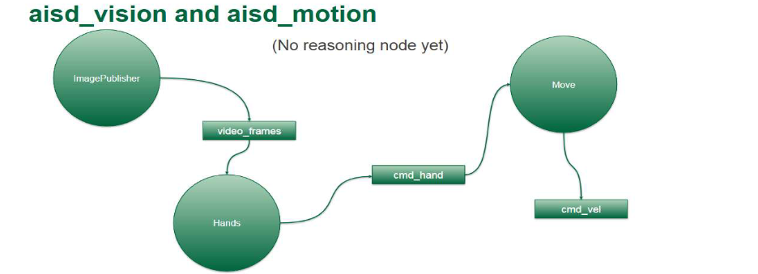

# Assignment 2 - ROS 2 Hand Gesture Control System

A ROS 2-based system that provides hand gesture recognition and robot motion control. The system uses MediaPipe to identify hand poses and converts gestures into robot motion commands for controlling a turtle robot.

## Quick Start

### Prerequisites

1. **Install Git** (Ubuntu):

   ```bash
   sudo apt-get update
   sudo apt-get install git
   ```

2. **Configure Git authentication** (if using HTTPS with Personal Access Token):

   ```bash
   git config --global credential.helper store
   echo "https://zhizhunbao:<YOUR_PERSONAL_ACCESS_TOKEN>@github.com" >> ~/.git-credentials
   chmod 600 ~/.git-credentials
   ```

3. **Clone the repository**:

   ```bash
   mkdir -p ~/ros2_ws/src
   cd ~/ros2_ws/src
   git clone https://github.com/gitalg/aisd-vision-zhizhunbao.git
   cd aisd-vision-zhizhunbao
   ```

4. **Install ROS 2** (Humble or later recommended)

## Installation

### Common Setup (Required)

```bash
# 1. Source ROS 2
source /opt/ros/humble/setup.bash

# 2. Install system dependencies
sudo apt update
sudo apt install -y python3-pip

# 3. Install ROS dependencies
cd ~/ros2_ws
rosdep update
rosdep install -i --from-path src --rosdistro humble -y

# 4. Build workspace
cd ~/ros2_ws
rm -rf build/ install/ log/
colcon build --symlink-install

# 5. Source the workspace
source ~/ros2_ws/install/setup.bash
```

### Assignment 2 Dependencies (Vision & Motion)

```bash
# Install Python packages for vision and motion
pip3 install numpy==1.25.2
pip3 install "empy<4.0"
pip3 install catkin_pkg
pip3 install lark
pip3 install mediapipe
pip3 install "opencv-python<4.9.0"

# Rebuild workspace after installing dependencies
cd ~/ros2_ws
colcon build --symlink-install
source ~/ros2_ws/install/setup.bash
```

## Running the System

The vision and motion system provides hand gesture recognition and robot motion control.

Open 4 separate terminals. In each terminal, source the workspace:

```bash
source ~/ros2_ws/install/setup.bash
```



**Terminal 1 - Turtlesim:**

```bash
ros2 run turtlesim turtlesim_node --ros-args --remap /turtle1/cmd_vel:=cmd_vel
```

**Terminal 2 - Image Publisher:**

```bash
ros2 run aisd_vision image_publisher
```

**Terminal 3 - Motion Controller:**

```bash
ros2 run aisd_motion move
```

**Terminal 4 - Hand Gesture Detector:**

```bash
ros2 run aisd_vision hands
```

**Data Flow:** Camera → Image Publisher → Hand Gesture Detector → Motion Controller → Turtlesim

### Hand Gestures

| Gesture       | Action           | Condition              |
| ------------- | ---------------- | ---------------------- |
| 👈 Turn Left  | angular.z = 0.1  | xindex < 0.45          |
| 👉 Turn Right | angular.z = -0.1 | xindex > 0.55          |
| 👆 Straight   | angular.z = 0.0  | 0.45 ≤ xindex ≤ 0.55 |
| ✋ Forward    | linear.x = 0.5   | xindex > xpinky        |
| 🖐️ Stop     | linear.x = 0.0   | xindex ≤ xpinky       |

## 📦 Package Overview

### Assignment 2 - Vision & Motion

- **aisd_vision**: Hand gesture recognition using MediaPipe
  - `image_publisher`: Captures camera frames and publishes to `video_frames` topic
  - `hands`: Detects hand landmarks and publishes to `cmd_hand` topic
- **aisd_motion**: Motion control based on hand gestures
  - `move`: Converts hand positions to velocity commands on `cmd_vel` topic

## 🔧 Troubleshooting

### Camera Not Detected

If the camera is not detected:

1. Check camera permissions: `ls -l /dev/video*`
2. Test camera with: `v4l2-ctl --list-devices`
3. Try different camera indices in the code if multiple cameras are available

### MediaPipe Installation Issues

If you encounter issues with MediaPipe:

```bash
pip3 uninstall mediapipe
pip3 install mediapipe
```

### OpenCV Version Conflicts

If you encounter OpenCV issues:

```bash
pip3 uninstall opencv-python opencv-contrib-python
pip3 install "opencv-python<4.9.0"
```

---

**Author**: Wang Peng ([zhizhunbao](https://github.com/zhizhunbao)) (wang1059@algonquinlive.com) | CST8504 - Algonquin College

