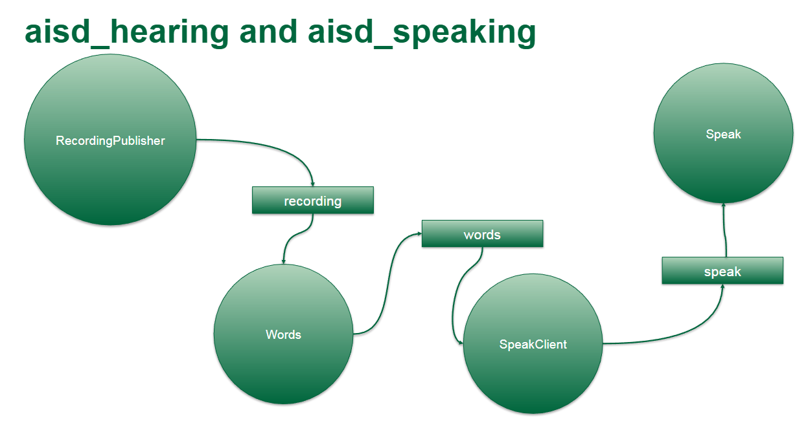
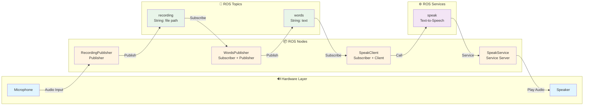

# Assignment 3 - ROS 2 Hearing & Speaking System

A ROS 2-based system that provides audio recording, speech-to-text transcription, and text-to-speech capabilities.

## Installation

### Prerequisites

- ROS 2 (Humble or later)
- Python 3

### Setup

```bash
# 1. Clone repository
mkdir -p ~/ros2_ws/src && cd ~/ros2_ws/src
git clone https://github.com/gitalg/aisd-vision-zhizhunbao.git
cd aisd-vision-zhizhunbao

# 2. Install system dependencies
source /opt/ros/humble/setup.bash
sudo apt update
sudo apt install -y \
    python3-pip \
    python-is-python3 \
    alsa-utils \
    portaudio19-dev \
    ffmpeg

# 3. Install Python dependencies
pip3 install \
    pyaudio \
    openai-whisper \
    pydub \
    gtts

# 4. Install ROS 2 dependencies (from package.xml)
cd ~/ros2_ws
rosdep update
rosdep install -i --from-path src --rosdistro humble -y

# 5. Build workspace
colcon build --symlink-install
source install/setup.bash

# 6. Create recordings directory
mkdir -p ~/ros2_ws/install/aisd_hearing/share/aisd_hearing/recordings
```

**Dependencies Overview:**

| Category         | Package                                | Purpose                               |
| ---------------- | -------------------------------------- | ------------------------------------- |
| **System** | `python3-pip`, `python-is-python3` | Python package management             |
| **System** | `alsa-utils`                         | Audio system utilities                |
| **System** | `portaudio19-dev`                    | Audio I/O library (for pyaudio)       |
| **System** | `ffmpeg`                             | Audio/video processing                |
| **Python** | `pyaudio`                            | Audio recording and playback          |
| **Python** | `openai-whisper`                     | Speech-to-text transcription          |
| **Python** | `pydub`                              | Audio manipulation                    |
| **Python** | `gtts`                               | Google Text-to-Speech                 |
| **ROS 2**  | `rclpy`                              | ROS 2 Python client library           |
| **ROS 2**  | `std_msgs`                           | Standard ROS 2 message types          |
| **ROS 2**  | `aisd_msgs`                          | Custom message types for this project |

## Running the System



Open 4 terminals and source the workspace in each:

```bash
source ~/ros2_ws/install/setup.bash
```

**Terminal 1 - Speak Service:**

```bash
ros2 run aisd_speaking speak
```

**Terminal 2 - Recording Publisher:**

```bash
ros2 run aisd_hearing recording_publisher
```

**Terminal 3 - Words Publisher:**

```bash
ros2 run aisd_hearing words_publisher
```

**Terminal 4 - Speak Client:**

```bash
ros2 run aisd_hearing speak_client
```

**Data Flow:**

**System Architecture Diagram:**



### Recording Behavior

The recording system automatically starts when sound is detected and stops based on multiple conditions. The following table shows the parameter modifications from the template code:

| Parameter                                            | Template Code Parameter | Modified Parameter       | Modification Reason                                                                                              |
| ---------------------------------------------------- | ----------------------- | ------------------------ | ---------------------------------------------------------------------------------------------------------------- |
| **Sound Threshold (THRESHOLD)**                | 500                     | 1000                     | Increase threshold to adapt to noisy environments, reduce false triggers from background noise                   |
| **Silence Detection (SILENT_CHUNKS_REQUIRED)** | 30 chunks (~1.5s)       | 78 chunks (~5s)          | Increase silence detection time to avoid premature recording stop during speech pauses or thinking               |
| **Time Limit (MAX_RECORDING_TIME)**            | No limit                | 30 seconds               | Prevent excessive recording duration, ensure timely processing and response, suitable for conversation scenarios |
| **Safety Limit (MAX_RECORDING_CHUNKS)**        | No limit                | 3000 chunks (~5 minutes) | Safety mechanism to prevent infinite recording, avoid memory overflow and disk space exhaustion                  |

### Run All Nodes in Background

```bash
ros2 run aisd_speaking speak & \
ros2 run aisd_hearing recording_publisher & \
ros2 run aisd_hearing words_publisher & \
ros2 run aisd_hearing speak_client &
```

Stop: `jobs` to list, `kill %N` to stop

## Package Overview

- **aisd_hearing**
  - `recording_publisher`: Records audio, publishes file paths
  - `words_publisher`: Transcribes audio using Whisper
  - `speak_client`: Sends text-to-speech requests
- **aisd_speaking**
  - `speak`: Text-to-speech service

All nodes use structured logging with `[Tag]` prefixes for readability.

## Troubleshooting

### Recording Publisher Hanging

**Fixed in current version** - Recording runs in separate thread. If using older version:

1. Update code: `git pull`

### Version Conflicts

If you see `AttributeError: module 'coverage' has no attribute 'types'`:

```bash
pip3 uninstall coverage numba openai-whisper -y
pip3 install "openai-whisper==20240930" "numba==0.62.1" "coverage==7.12.0"
```

### Service Not Available

1. Start `speak` service first: `ros2 run aisd_speaking speak`
2. Check: `ros2 service list | grep speak`
3. Start nodes in order: speak service → speak_client

### Audio File Not Found

1. Check directory: `ls ~/ros2_ws/install/aisd_hearing/share/aisd_hearing/recordings`
2. Verify `recording_publisher` is running
3. Check logs for `[Error]` messages

### First Run

- Whisper will download base model (~150MB) on first run
- Ensure internet connection and sufficient disk space

---

###### **Author**: Wang Peng ([zhizhunbao](https://github.com/zhizhunbao)) | CST8504 - Algonquin College
