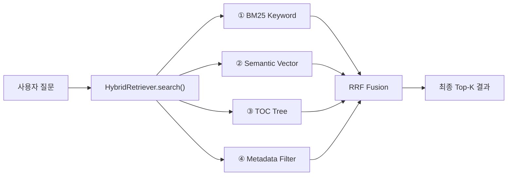
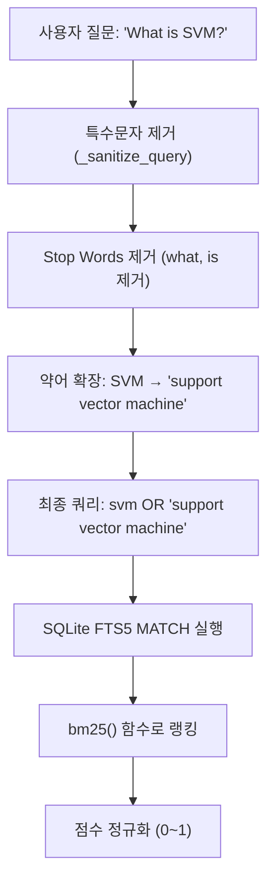
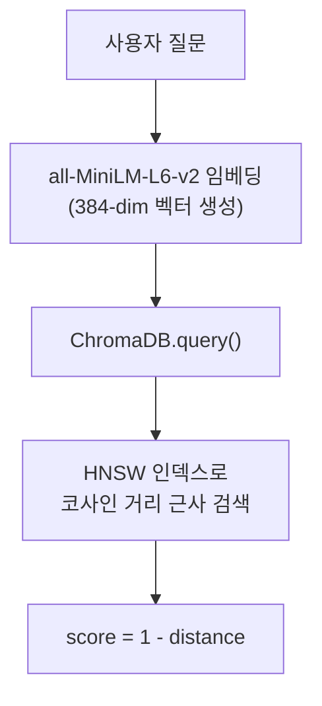
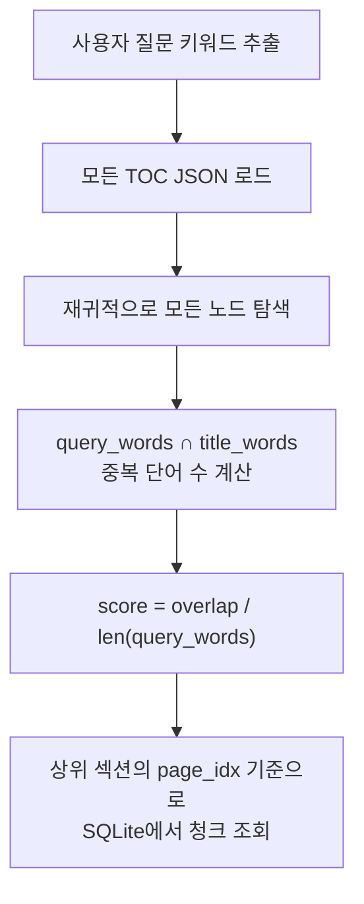
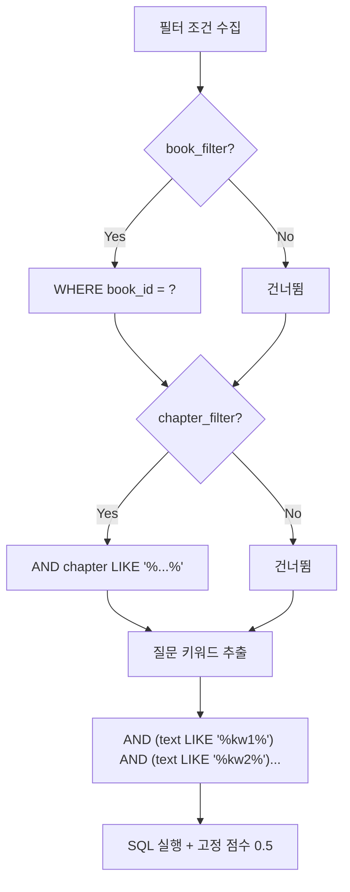

# 🔍 4가지 Retrieval 방법 — 원리 & 실행 시점 분석

## 전체 흐름 개요



사용자가 질문을 입력하면, `HybridRetriever.search()` (`backend/retrieval/fusion.py`)가 **4가지 방법을 병렬로 실행**한 뒤, **RRF(Reciprocal Rank Fusion)**로 결합합니다. UI에서 체크박스를 끄면 해당 방법은 `methods` 리스트에서 제외됩니다.

---

## ① BM25 Keyword Search (SQLite FTS5)

> **파일**: `backend/retrieval/fts_search.py`
> **저장소**: SQLite FTS5 가상 테이블 (`chunks_fts`)

### 원리

**TF-IDF 계열의 BM25 랭킹 알고리즘**으로, 질문에 포함된 **키워드가 문서에 얼마나 자주 등장하는지**를 기반으로 점수를 매깁니다.



### 핵심 단계

| 단계 | 코드 위치 | 설명 |
|------|-----------|------|
| 1. 쿼리 정제 | `_sanitize_query()` | `'`, `"`, `?`, `*` 등 FTS5 특수 문법 제거 |
| 2. Stop Words 제거 | `_build_fts_query()` | `what`, `is`, `the` 등 의미 없는 단어 제거 |
| 3. 약어 확장 | `ABBREVIATIONS` dict | `SVM` → `"support vector machine"` (22개 약어 매핑) |
| 4. FTS5 검색 | `SQLiteIndexer.search_fts()` | `WHERE chunks_fts MATCH ?` + `bm25()` 함수 |
| 5. 점수 정규화 | `FTSSearcher.search()` | BM25 음수값 → 0~1 범위 (min-max 정규화) |

### 스코어링

```python
# BM25는 음수를 반환함 (낮을수록 좋음) → 0~1로 변환
normalized_score = 1 - (score - min_score) / (max_score - min_score)
```

### 실행 시점
- **색인 시**: 청크가 `chunks` 테이블에 INSERT될 때 **트리거**가 자동으로 `chunks_fts` FTS5 테이블에 동기화
- **검색 시**: 사용자 질문이 들어오면 즉시 FTS5 MATCH 쿼리 실행 (매우 빠름, ~ms 단위)

---

## ② Semantic Vector Search (ChromaDB + MiniLM)

> **파일**: `backend/retrieval/vector_search.py`, `backend/pipeline/indexer.py` (ChromaIndexer)
> **저장소**: ChromaDB (벡터 데이터베이스)

### 원리

질문과 문서를 모두 **384차원 벡터**로 변환한 뒤, **코사인 유사도**로 의미적 유사성을 측정합니다.



### 핵심 단계

| 단계 | 코드 위치 | 설명 |
|------|-----------|------|
| 1. 임베딩 생성 | `ChromaIndexer.embedding_fn` | `SentenceTransformerEmbeddingFunction("all-MiniLM-L6-v2")` |
| 2. 벡터 검색 | `collection.query()` | HNSW 알고리즘으로 근사 최근접 이웃 검색 |
| 3. 거리 → 유사도 | `ChromaIndexer.search()` | `score = 1 - cosine_distance` |

### 스코어링

```python
# ChromaDB는 cosine distance를 반환 (0~2 범위, 0이 완전 동일)
score = 1 - distance  # → 코사인 유사도 (1이 최고)
```

### BM25와의 차이점

| | BM25 | Semantic Vector |
|---|---|---|
| 매칭 방식 | **정확한 키워드** 일치 | **의미적** 유사성 |
| "SVM"으로 검색 시 | "SVM"이라는 단어가 포함된 문서만 검색 | "support vector machine", "classifier", "kernel" 등 관련 문서도 검색 |
| 장점 | 정확한 용어가 있을 때 강력 | 동의어, 패러프레이즈 처리 가능 |
| 단점 | 동의어 미스 | 무관한 문서에도 높은 점수 가능 |

### 실행 시점
- **색인 시**: 각 청크 텍스트를 `all-MiniLM-L6-v2`로 384차원 벡터로 변환 → ChromaDB에 저장 (`hnsw:space = cosine`)
- **검색 시**: 질문도 동일 모델로 벡터화 → HNSW 인덱스에서 근사 최근접 이웃 검색

---

## ③ TOC Tree Search (목차 트리 탐색)

> **파일**: `backend/retrieval/tree_search.py`, `backend/pipeline/toc_builder.py`
> **저장소**: JSON 파일 (`{book_id}_toc.json`)

### 원리

각 교과서의 **목차(Table of Contents)를 계층적 트리**로 구축한 뒤, 질문 키워드와 목차 제목의 **단어 겹침(overlap)**을 계산하여 관련 섹션을 찾고, 해당 섹션의 청크를 반환합니다.



### 핵심 단계

| 단계 | 코드 위치 | 설명 |
|------|-----------|------|
| 1. TOC 빌드 | `TOCBuilder._build_tree()` | heading 레벨 기반 스택으로 트리 구축 (level 1=장, 2=절, 3=소절) |
| 2. TOC 로드 | `TreeSearcher._load_all_tocs()` | `data/toc/{book_id}_toc.json` 로드 (캐싱) |
| 3. 노드 스코어링 | `TreeSearcher._score_nodes()` | 재귀적 키워드 겹침 계산 |
| 4. 청크 조회 | `TreeSearcher.search()` | 매칭된 섹션의 `page_idx ~ page_idx+2` 범위에서 청크 조회 |

### 스코어링

```python
# 질문 키워드와 TOC 제목 단어의 겹침 비율
overlap = len(query_words & title_words)   # 교집합
score = overlap / max(len(query_words), 1)  # 0~1 범위
```

### TOC 트리 구조 예시

```
📖 Art Of Machine Learning
├── [1] Introduction (p.1)
│   ├── [2] What is Machine Learning? (p.3)
│   └── [2] Types of ML (p.7)
├── [1] Supervised Learning (p.15)
│   ├── [2] Linear Regression (p.17)
│   └── [2] Support Vector Machine (p.45)  ← "SVM" 질문 시 매칭
│       ├── [3] Kernel Trick (p.48)
│       └── [3] SVM Implementation (p.52)
```

### 실행 시점
- **색인 시**: MinerU의 `content_list.json`에서 heading 엔트리를 추출 → `text_level`(1/2/3)로 계층 트리 구축 → JSON 저장
- **검색 시**: 질문 단어 ↔ 모든 TOC 노드 제목 비교 → 매칭 섹션의 페이지 범위에서 청크 조회

---

## ④ Metadata Filter (구조화 필터링)

> **파일**: `backend/retrieval/metadata_search.py`
> **저장소**: SQLite `chunks` 테이블

### 원리

벡터나 키워드 매칭 없이, **구조화된 메타데이터 필드**(book_id, chapter, page_idx, content_type)로 SQL WHERE 조건을 동적으로 생성하여 필터링합니다. 추가로 질문에서 키워드를 추출해 `text LIKE '%keyword%'` 조건도 추가합니다.



### 핵심 단계

| 단계 | 코드 위치 | 설명 |
|------|-----------|------|
| 1. 조건 빌드 | `MetadataSearcher.search()` | `book_id`, `chapter`, `content_type`, `page_range` → SQL WHERE 동적 생성 |
| 2. 키워드 추출 | `_extract_keywords()` | stop words 제거 + 2글자 이하 제거 |
| 3. LIKE 매칭 | `search()` L63-L68 | 각 키워드가 `text` 또는 `chapter` 컬럼에 포함되어야 함 (AND 조건) |
| 4. 고정 점수 | `search()` L94 | `score = 0.5` (랭킹 정보가 없으므로 고정) |

### 스코어링

```python
score = 0.5  # 고정값 — 메타데이터 필터는 관련성 점수가 없음
```

> **NOTE**: Metadata Filter는 BM25/Vector처럼 "얼마나 관련 있는지"를 계산하지 않고, "조건에 맞는지/아닌지"만 판단합니다. 따라서 고정 점수 0.5입니다.

### 실행 시점
- **색인 시**: 각 청크의 메타데이터(book_id, chapter, section, content_type, page_idx)가 `chunks` 테이블에 저장됨
- **검색 시**: 사용자가 특정 책/챕터/페이지 범위를 지정하면 SQL WHERE로 필터링

---

## 🔀 결합: Reciprocal Rank Fusion (RRF)

> **파일**: `backend/retrieval/fusion.py`

### RRF 공식

$$RRF\_score(d) = \sum_{i=1}^{n} w_i \cdot \frac{1}{k + rank_i(d)}$$

- `k = 60` (표준값, Cormack et al., 2009)
- `rank_i(d)` = 방법 i에서 문서 d의 순위 (1부터 시작)
- `w_i` = 방법별 가중치

### 가중치

| 방법 | 가중치 | 이유 |
|------|--------|------|
| BM25 Keyword | **2.0** | 키워드 매칭은 강한 신호 |
| Semantic Vector | **2.0** | 의미적 유사도도 강한 신호 |
| TOC Tree | 1.0 | 보조적 신호 |
| Metadata Filter | 1.0 | 보조적 신호 |

### 후처리 전략

```python
# 1. 책 단위 중복 제거: 같은 책에서 가장 높은 점수의 청크만 유지
# 2. 다중 방법 우선: 2개 이상 방법에서 검색된 청크를 우선 배치
multi_method = [r for r in fused if len(r["method_ranks"]) >= 2]  # 우선
single_method = [r for r in fused if len(r["method_ranks"]) < 2]  # 보충
```

### 점수 정규화 (UI 표시용)

RRF 원시 점수는 매우 작은 값(최대 ~0.098)이므로, UI에 **0~1 범위**로 변환하여 표시합니다.

```
이론적 최대 RRF 점수 (4가지 모두 1등):
  RRF_MAX = (2+2+1+1) / (60+1) = 6/61 ≈ 0.0984

정규화 공식:
  UI_score = rrf_score / RRF_MAX
```

| 상황 | RRF 원시 점수 | UI 표시 점수 |
|------|---------------|-------------|
| 4가지 모두 1등 | 0.0984 | **1.0000** |
| BM25+Vector 1등, 나머지 없음 | 0.0656 | **0.6667** |
| BM25만 1등 | 0.0328 | **0.3333** |
| TOC만 5등 | 0.0154 | **0.1563** |

> **코드 위치**: `backend/rag/engine.py` — `_format_sources()` 메서드

```python
RRF_MAX = 6.0 / 61.0  # 이론적 최대값

# rrf_score를 0~1로 환산
normalized = min(rrf_score / RRF_MAX, 1.0)
```

---

## 🎯 Cross-Encoder Reranking (품질 점수)

> **파일**: `backend/retrieval/reranker.py`
> **모델**: `cross-encoder/ms-marco-MiniLM-L-6-v2` (~80MB)

### 왜 필요한가?

RRF는 **랭킹 기반**이므로 "1등인지 2등인지"만 보고, 실제 관련성 차이를 무시합니다.

```
문제 예시:
  BM25 1등: cosine=0.95 (매우 관련)  →  rank_score 높음 ✅
  BM25 2등: cosine=0.12 (거의 무관)  →  rank_score도 비슷하게 높음 ❌
  → RRF는 이 둘을 비슷한 점수로 취급
```

### 원리: Bi-Encoder vs Cross-Encoder

```
Bi-Encoder (기존 Vector Search):     Cross-Encoder (추가):
  질문 → [벡터]                        (질문 + 문서) → [관련성 점수]
  문서 → [벡터]                        하나의 입력으로 함께 처리
  → 코사인 유사도                      → 직접 0~1 점수 출력

  빠름 (독립 인코딩)                   느림 (쌍별 인코딩)
  85,356개 전체 검색 가능              Top-K 후보만 재평가
```

### Dual Score 구조

```
기존 파이프라인 (변경 없음)
────────────────────────
4가지 검색 → RRF Fusion → rank_score (0~1)   ← 그대로 유지
                              │
                    ┌─────────┴─────────┐
                    │   Cross-Encoder    │   ← 추가
                    │  (query, doc) 쌍   │
                    └─────────┬─────────┘
                              │
                       quality_score (0~1)   ← 새 필드
```

### UI 표시

```
📖 Bishop PRML (p.45)
  Rank: 0.8500 | Q: 0.94   ← 초록색 (≥0.7)

📖 Goodfellow DL (p.120)
  Rank: 0.7200 | Q: 0.08   ← 회색 (<0.4, 실제 무관)
```

| Quality Score 범위 | 색상 | 의미 |
|---|---|---|
| ≥ 0.70 | 🟢 초록 | 높은 관련성 |
| 0.40 ~ 0.69 | 🟡 노랑 | 보통 관련성 |
| < 0.40 | ⚪ 회색 | 낮은 관련성 |

> **코드 위치**: `backend/rag/engine.py` — `ask()` 메서드 Step 6

```python
# Cross-Encoder로 (query, document) 쌍의 실제 관련성 점수 계산
from sentence_transformers import CrossEncoder
model = CrossEncoder("cross-encoder/ms-marco-MiniLM-L-6-v2")
scores = model.predict([(query, doc_text), ...])
quality_score = sigmoid(score)  # 0~1 정규화
```

---

## 📊 전체 실행 순서 타임라인

```
사용자 질문 입력
    │
    ├─→ ① FTS5 BM25 (SQLite)      ~1ms   ─┐
    ├─→ ② ChromaDB Vector         ~50ms   ─┤
    ├─→ ③ TOC Tree (JSON+SQLite)  ~10ms   ─┤  병렬 실행 (per_method_k = top_k × 3)
    └─→ ④ Metadata Filter (SQL)   ~5ms    ─┘
                                            │
                                     RRF Fusion (가중 합산)
                                            │
                                     Book 단위 중복 제거
                                            │
                                     Multi-method 우선 정렬
                                            │
                                     rank_score 계산 (0~1)  ← 기존
                                            │
                                     Cross-Encoder Rerank   ← 추가
                                            │
                                     quality_score 계산 (0~1)
                                            │
                                     최종 Top-K (dual score) 반환
```

> **왜 4가지를 조합하나?** 단일 방법은 각각 약점이 있습니다:
> - BM25: 동의어 못 찾음 → Vector가 보완
> - Vector: 희귀 전문 용어에 약함 → BM25가 보완
> - 둘 다: 구조(어떤 장, 어떤 절) 모름 → TOC Tree가 보완
> - 셋 다: 특정 책/페이지 제한 못함 → Metadata Filter가 보완
> - **넷 다: 품질 점수를 모름 → Cross-Encoder가 보완**

